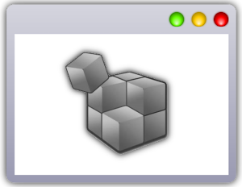

GameEditor2D - editor for 2D tile games

=======================================

Features
---------
<ul>
    <li>independent editor for 2D tile-based game engines (with reload support)</li>
    <li>run game with parameters</li>
    <li>catch engine log</li>
    <li>send cmmands</li>
    <li>asset browser</li>
    <li>edit tilemap with tileset</li>
    <li>edit GLSL, json, etc. text files</li>
    <li>view audio and image files</li>
</ul>

Technology
----------
<ul>
    <li>modern C# .NET 7 platform</li>
    <li>WPF UI with MVVM + BL architecture</li>
    <li>modular, n-tier environment</li>
    <li>SpecFlow BDD process</li>
</ul>